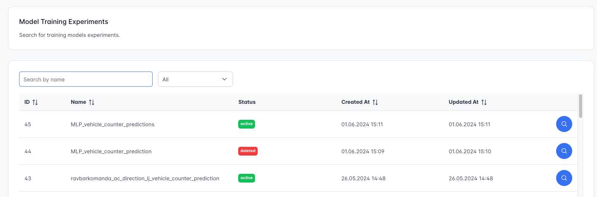

# TrafficSense ~ Predicting Travel Times & Traffic Flow on Highways in Slovenia

[Vue Web App Demo](https://traffic-flow-prediction-web-app.onrender.com)
| [Prediction API Demo](https://traffic-flow-prediction-api-0-1-0.onrender.com/docs) (DISCLAIMER: it can take up to 1 minute for all the Docker containers on Render to start when cold start.)


# Table of Contents
0. [Screenshots](#screenshots)
1. [Introduction](#introduction)
2. [How to Run](#how-to-run)
3. [Project Structure](#project-structure)
4. [Collecting Traffic Data](#collecting-traffic-data)
5. [Training Models](#training-models)
6. [Model Architecture](#model-architecture) 
7. [Onnx, Optimization & Model Compression](#onnx)
8. [Mlflow Experiments & Model Registry](#mlflow)
9. [Prediction API](#prediction-api)

## Screenshots
Number of vehicles per lane predictions:


Displaying model metrics:


Browsing Mlflow experiments:


Current champion model:


Browsing model registry:


Changing model stage


Model info


## How to Run
First you need to connect your repository to DashHub, where there is integrated DVC versioning and Mlflow. You also need to create MongoDB database.

Prediction API (Python FastAPI)
```python
cd src/serve
python api.py
```

Vue Web App
```python
cd src/client
npm run dev
```

## Introduction
Welcome to the TrafficSense, an intelligent system that aims to predict travel times and traffic flow on highways in Slovenia using machine learning techniques (recurrent neural networks). By analyzing historical traffic data, weather conditions, and other relevant factors, our model provides accurate predictions to help drivers plan their journeys more effectively.


## Project structure

```python
- data  # data from dvc
- src
    - client # vue web app
    - data  # data scrapers & scripts for processing data
        - scrapers
        - test
        - weather
    - models # scripts for training, evaluating and registering models
        - travel_times  # models for predicting travel times
        - vehicle_counter # models for predicting vehicle counters
    - serve # python prediction API
    - utils 
    - visualization
```

## Collecting Traffic Data
The system collects data on travel times and vehicle counts from "Promet.si" using custom web scrapers (Selenium Python). Weather data is sourced from OpenMeteo. When data is fetched, it is processed for each location seperately. After successful testing and validation, data is pushed to DVC versioning system. This entire process is automated to run every hour using GitHub Actions.


## Training Models
Predictive model uses a recurrent neural network (RNN) architecture, specifically the Gated Recurrent Unit (GRU). The model's window size is set to 24. Each location has unique traffic density patterns, so models are trained seperate for each one. The training process is automated using GitHub Actions and occurs daily (every 24 hours).


## Model Architecture
```python
def create_gru_model(input_shape):
    model = Sequential([
        GRU(64, input_shape=input_shape, return_sequences=True),
        GRU(32),
        Dense(16, activation='relu'),
        Dense(1)
    ])

    model.compile(optimizer=Adam(learning_rate=0.0004), loss='mse')
    return model
```

## Onnx, Optimization & Model Compression
To enhance operability and speed, trained models are converted to the ONNX (Open Neural Network Exchange) format. This conversion allows for more efficient model deployment and faster inference times.

```python
# Convert to onnx
onnx_model, _ = tf2onnx.convert.from_keras(model, input_signature=[tf.TensorSpec(shape=(None, len(features), window_size), dtype=tf.float32)])
model_path = f'{MODELS_DIR}/{location_name}/model.onnx'
onnx.save_model(onnx_model, model_path)

# Optimize onnx model
passes = [
    "eliminate_deadend",
    "eliminate_identity",
    "eliminate_nop_dropout",
    "eliminate_nop_monotone_argmax",
    "eliminate_nop_pad",
    "eliminate_unused_initializer"
]
optimized_model = onnxoptimizer.optimize(onnx_model, passes)
optimized_model_path = f'{MODELS_DIR}/{location_name}/optimized_model.onnx'
onnx.save_model(optimized_model, optimized_model_path)

# Quantize the model (model compression)
quantized_model_path = f'{MODELS_DIR}/{location_name}/quantized_model.onnx'
quantize_dynamic(optimized_model_path, quantized_model_path, weight_type=QuantType.QInt8)
```

## Mlflow Experiments & Model Registry
MLflow is used to track experiments and manage the model lifecycle, ensuring a robust and organized approach to machine learning workflows.

### Experiments
- Tracking: Logs training runs with model metrics.
- Comparisons: Easily compare model versions and configurations.
- Visualizations of metrics.

### Model Registry
- Versioning: Models are versioned for traceability.
- Staging: Models are moved through stages like "Staging", "Production" and "Archive".

Prediction API downloads fresh models from Mlflow.

## Prediction API
Python FastAPI downloads fresh production models from Mlflow and exposes different endpoints for predictions.

Example: Endpoint for travel time predictions
```python
@app.get("/api/v1/travel-times/predict/{route}/{hours}")
async def predict_travel_times_service(route: str, hours: int):
    """
    Predict travel times for a specific location and number of hours.
    - **route**: The name of the route (LJ_KP, KP_LJ...). 
    - **hours**: The number of hours to predict.
    """
    if route not in scalers:
        raise HTTPException(status_code=404, detail="Location not found")

    model_scalers = scalers[route]
    if model_scalers is None:
        raise HTTPException(status_code=404, detail="Location not found")

    predictions = predict_travel_times_for_next_hours(f'{route}_model.onnx', model_scalers, route, hours)

    return {'predictions': predictions}
```
